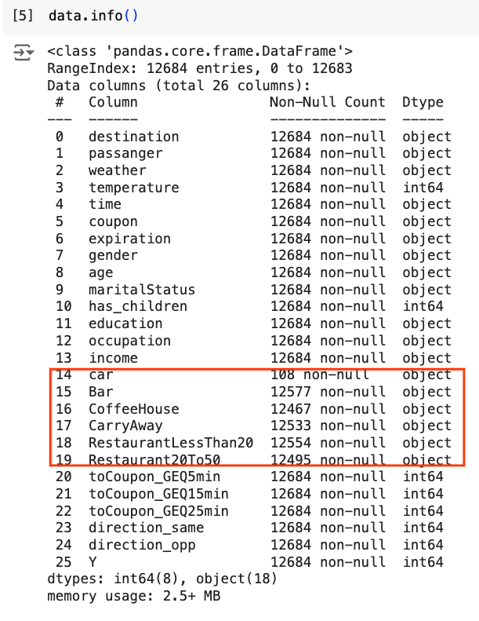
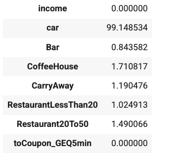
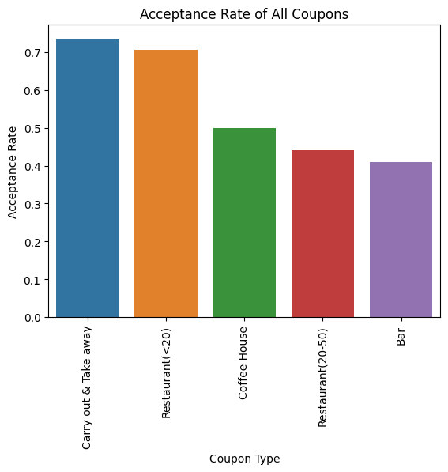
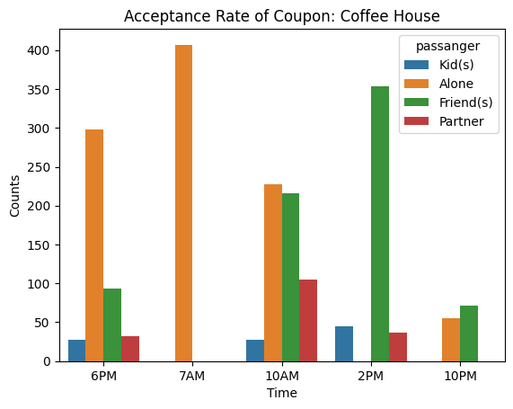
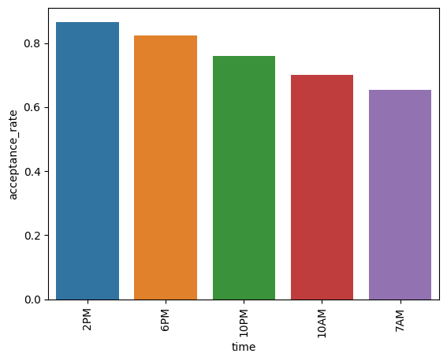

# Will the Customer Accept the Coupon?

By: Deep Joshi

Github repo: [https://github.com/deepjoshi1/berkeley_ai_ml_assignment_mod5_coupon](https://github.com/deepjoshi1/berkeley_ai_ml_assignment_mod5_coupon)


* Notebook: **customer_and_coupon.ipynb**
* Data set:  **data/coupons.csv**

# Table of contents
* [Introduction](#introduction)
* [Data Description](#data-description)
* [Analysis](#analysis)
    * [Understanding Data](#understanding-data)
    * [Coupon Types](#coupon-types)
    * [Coupon type: Bar](#coupon-type-bar)
       * [Conclusion](#conclusion1.1)
    * [Coupon type: Restaurant(&lt;20](#coupon-type-restaurant-<20)
       * [Conclusion](#Conclusion2.1)
    * [Coupon type: Coffee House](#coupon-type-coffee-house)
       * [Conclusion](#Conclusion3.1)
    * [Coupon type: Carry out & Take away](#coupon-type-carry-out-&-take-away)
       * [Conclusion](#Conclusion3.1)

# Introduction <a name="introduction"></a>

This analysis explores whether customers will accept coupons in various driving scenarios. The study uses data from a survey conducted on Amazon Mechanical Turk, where participants were presented with different driving situations and asked if they would accept a coupon. The survey considered factors such as destination, time of day, weather, and passenger.   

<div id='data-description'/>
# Data Description
This data is from the UCI Machine Learning Repository and was collected via a survey on Amazon Mechanical Turk. The survey describes different driving scenarios, including the destination, current time, weather, and passenger, and then asks people whether

they will accept the coupon if they are the driver. There are three possible answers people can choose from:


* “Right away”
* “Later, before the coupon expires”
* “No, I do not want the coupon”

The first two responses are labeled as “Y = 1,” and the third is labeled as “Y = 0.” There are five different types of coupons: Less expensive restaurants (under $20), coffee houses, carryout and takeaway, bars, and more expensive restaurants ($20–$50).

# Analysis <a name="analysis"></a>

The analysis uses Python with the pandas, Matplotlib, and Seaborn libraries to process and visualize the survey data. After cleaning the data by handling missing values, the analysis focuses on different coupon types and identifies key demographic and situational factors that correlate with higher acceptance rates.

This information can be valuable for businesses seeking to optimize their coupon distribution strategies by targeting specific customer segments and scenarios for maximum impact.


## Understanding Data <a name="understanding-data"></a>





Using the info() method of dataframe shows a few columns such as Bar, CoffeeHouse are missing some values but column cars are missing lots of values. To Get another perspective of msising data let’s further check the missing values in %. 

```
data.isnull().mean() * 100
```




It clearly shows that the car is missing values in 99% cases so it makes sense to drop this column and fill the rest missing categorical values with the mode.

## Coupon Types <a name="coupon-types"></a>

There are 5 types of coupons with the following count and accepted count


<table>
  <tr>
   <td><strong>coupon      </strong>
   </td>
   <td><strong>total_count    </strong>
   </td>
   <td><strong>accepted_count</strong>
   </td>
   <td><strong>acceptance_rate</strong>
   </td>
  </tr>
  <tr>
   <td>Coffee House 
   </td>
   <td> 3996 
   </td>
   <td>  1995
   </td>
   <td>.499249
   </td>
  </tr>
  <tr>
   <td>Restaurant(&lt;20)
   </td>
   <td>2786 
   </td>
   <td>1970
   </td>
   <td>0.707107
   </td>
  </tr>
  <tr>
   <td>Carry out & Take away 
   </td>
   <td>2393 
   </td>
   <td>1760
   </td>
   <td>0.735478
   </td>
  </tr>
  <tr>
   <td> Bar  
   </td>
   <td>2017
   </td>
   <td>658
   </td>
   <td>0.410015
   </td>
  </tr>
  <tr>
   <td> Restaurant(20-50)      
   </td>
   <td> 1492   
   </td>
   <td>1970
   </td>
   <td>0.441019
   </td>
  </tr>
</table>





## Coupon type: Bar <a name="coupon-type-bar"></a>

Dataframe is filtered for coupon type “Bar” for this analysis and stored in variable bar_coupons.

Compare the acceptance rate between those who went to a bar 3 or fewer times a month to those who went more.


* Acceptance rate of those who went to a bar 3 or fewer times a month:  37.07%
* Acceptance rate of those who went to a bar more than 3 times a month:  76.88%

Compare the acceptance rate between drivers who go to a bar more than once a month and are over the age of 25 to all others. Is there a difference?


* Acceptance rate between drivers who go to a bar more than once a month and are over the age of 25:  69.52%
* Acceptance rate rest:  39.33%
* Driver with age over 25 and and who go to bar more than once a month has acceptance rate difference:  30.19%
* Acceptance rate for drivers, go to bars more than once a month, had passengers that were not a kid, and were not widowed:  71.32

Acceptance rate for drivers, go to bars more than once a month and are under the age of 30:  72.17%


* Acceptance rate for drivers, go to cheap restaurants more than 4 times a month and income is less than 50K:  45.35
* Acceptance rate for drivers, go to bars more than once a month, had passengers that were not a kid, and were not widowed:  71.32
* Acceptance rate for drivers, go to bars more than once a month and are under the age of 30:  72.17%
* Acceptance rate for drivers, go to cheap restaurants more than 4 times a month and income is less than 50K:  45.35

<div id='conclusion1.1'/>
### Conclusion


* **Data-driven observation:** The provided data shows a high acceptance rate (76.88%) for coupons among drivers who visit bars more than three times a month. This suggests a correlation between bar visits and coupon acceptance.
* **Targeted demographic:** Furthermore, the data indicates that drivers under 30 who frequent bars exhibit a strong coupon acceptance rate (72.17%). This highlights a specific demographic (young, bar-going drivers) with a higher propensity for using coupons.

This hypothesis suggests that targeting ride-sharing coupons towards drivers who frequent bars, particularly those under 30 and those who are not transporting children, could result in higher acceptance and usage rates.

<div id='coupon-type-restaurant-'/>
## Coupon type: Restaurant(&lt;20)

* Drivers with age under 30 has acceptance rate of:  73.61 %

* Drivers with age above 30 has acceptance rate of:  68.32 %

<div id='Conclusion2.1'/>
### Conclusion

To achieve the highest acceptance rate for "Restaurant(&lt;20)" coupons, it's optimal to offer them to drivers under age 30.

<div id='coupon-type-coffee-house'/>
## Coupon type: Coffee House



<div id='conclusion3.1'/>
### Conclusion

To maximize the acceptance rate for "Coffee House" coupons, it's recommended to target drivers with a friend as a passenger, particularly around 7AM or 10AM or 2PM with friends. This specific scenario leads to a higher acceptance rate compared to other passenger combinations or times of the day.

<div id='coupon-type-carry-out-&-take-away'/>
## Coupon type: Carry out & Take away




<div id='conclusion4.1'/>
### Conclusion

To achieve the highest acceptance rate for "Carry out & Take away" coupons, it's optimal to offer them during lunch and dinner hours (2PM and 6PM).

